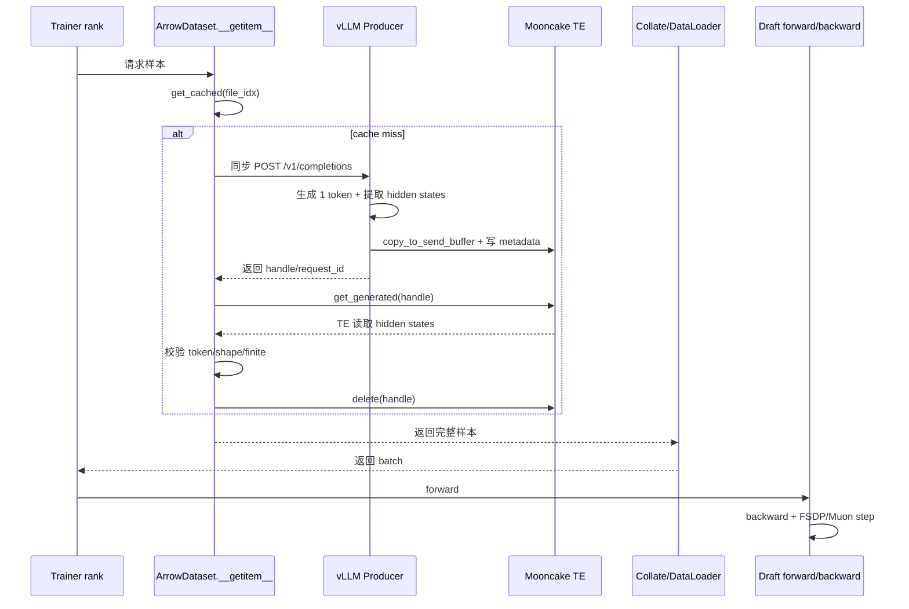
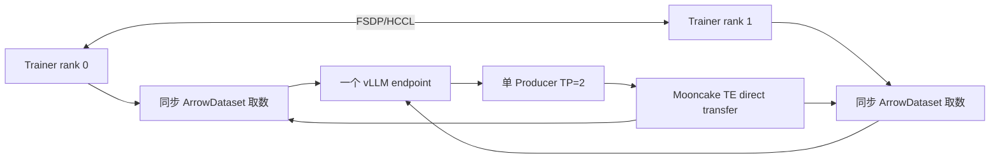
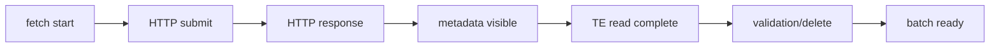
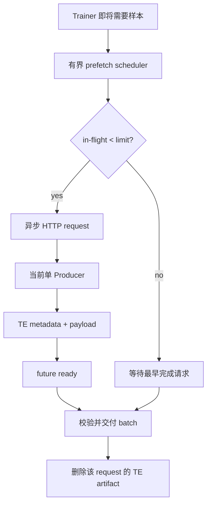
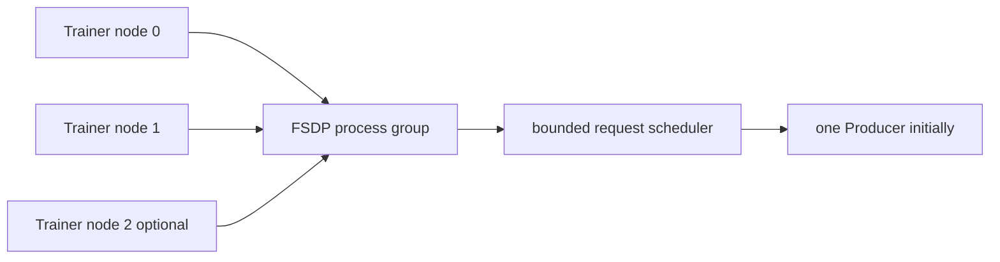
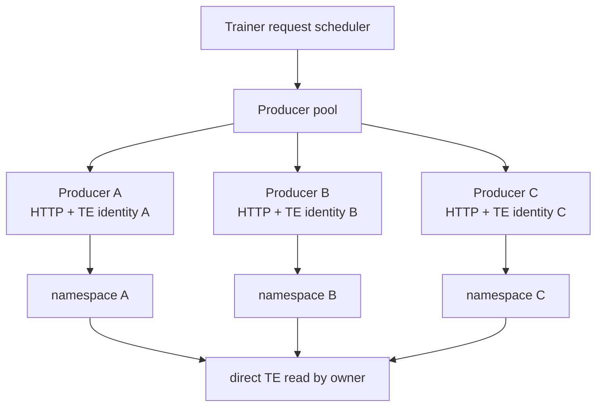
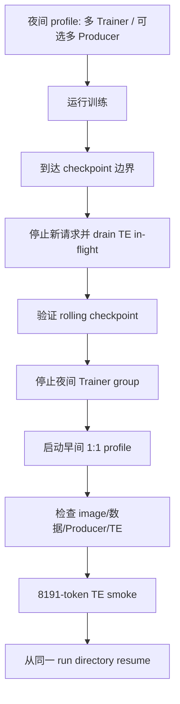

# DFlash2 多 Producer / 多 Trainer 分析

本文档基于实际运行仓库
`/mnt/hcs/y00917737/te_dspark_submission/speculators` 的当前代码分析，
不是基于工作区副本。当前代码基线为分支 `dflash2-ascend`、提交
`5f80834`。仓库中已有未提交的 Ascend/TE 修改和备份文件，本文不覆盖或
撤销这些现有改动。

## 结论先行

当前正式训练的主要问题不是“缺少几个 Producer 进程”这么简单。实际代码
是一个**同步取数的训练循环**：Trainer 取一个 batch 时，如果 hidden states
不存在，就在当前 Trainer 进程中同步调用一个 vLLM endpoint，等待 Producer
完成并通过 Mooncake TE 取回数据，然后才能进入模型 forward。

当前可执行的改造顺序是：

1. 在现有单 Producer、双 FSDP rank 上增加可观测性和有界异步预取。
2. 用实测确认一个 Producer 是否已经饱和。
3. 再将 Trainer 扩展为多节点 FSDP。
4. 只有单 Producer 被证实为瓶颈后，才增加 Producer pool 和请求路由。

不能把仓库中已有的离线数据生成异步代码直接当成训练时异步预取。两者
使用场景不同。

## 实际代码链路

### 正式训练路径

实际训练使用 `src/speculators/train/data.py` 中的 `ArrowDataset`。关键行为：

- 初始化时保存一个 `vllm_endpoint` 和一个同步 `openai.OpenAI` client；
- `_get_raw_data()` 先按 file index 查找缓存；
- cache miss 且 `on_missing=generate` 时，调用
  `_generate_hidden_states_once()`；
- `_generate_hidden_states_once()` 调用同步的
  `generate_hidden_states()`；
- HTTP 返回 handle 后，调用 `self.transfer.get_generated(handle)`；
- 校验 hidden states 和 token IDs 后删除 handle；
- 返回样本，DataLoader 才能组成 batch。



训练循环中的计时点在 `src/speculators/train/trainer.py`：

- `start` 在取 batch 前记录；
- `fetch` 在模型 forward 前记录；
- `fwd`、`bwd`、`opt` 分别记录计算阶段；
- `fetch_ms` 是从取 batch 到进入 forward 前的总等待，包含 DataLoader
  取数、HTTP、Producer 处理、metadata 等待和 TE 读取，不能单独代表网络
  传输时间。

### 当前拓扑



当前正式启动脚本仍然在 `deploy/start_train_te_dflash2.sh` 中执行：

```text
torchrun --nproc_per_node=${NPROC_PER_NODE} --nnodes=1
```

所以当前是单节点 Trainer 进程组，不是多节点 Trainer。

## 不能混淆的异步能力

运行时仓库确实有异步代码，但位置和用途如下：

```text
src/speculators/cli/generate_offline_data.py
  -> AsyncOpenAI
  -> asyncio.Queue / semaphore / worker
  -> 离线生成 hidden states 文件
```

这条路径用于离线数据生成，已经具有并发 worker 和请求 semaphore。但正式
训练使用的是：

```text
src/speculators/train/data.py
  -> openai.OpenAI
  -> generate_hidden_states()
  -> transfer.get_generated()
```

因此，当前仓库**没有训练时的异步 hidden-state prefetch**，也没有：

- 多 endpoint 列表；
- Producer pool；
- endpoint 负载均衡；
- Producer 健康状态和 drain 状态；
- Producer-specific TE metadata namespace；
- 请求和 Producer 的持久 ownership 记录。

## Mooncake TE ownership

运行时 `hs_connectors/src/hs_connectors/mooncake_te_store.py` 的 metadata
包含：

```json
{
  "producer_ip": "...",
  "rpc_port": 20454,
  "tensors": {}
}
```

Consumer 使用 metadata 中的 `producer_ip:rpc_port` 建立 TE 读取目标。当前
metadata 文件名由 request key 派生，并位于单一 `TE_META_DIR` 中。

这对单 Producer 是成立的。多 Producer 时必须保证：

1. 同一 logical request 只能有一个 Producer owner；
2. metadata 原子发布前 Consumer 不能读取；
3. Consumer 读取的 RPC endpoint 必须属于该 request 的 owner；
4. TE transfer 完成前不能删除对应 metadata 或复用发送缓冲区；
5. 不同 Producer 不能在共享目录中覆盖相同 key。

推荐将 request identity 扩展为：

```json
{
  "request_id": "sample-123",
  "producer_id": "producer-b",
  "producer_ip": "71.10.29.130",
  "rpc_port": 20454,
  "metadata_namespace": "producer-b",
  "tensors": {}
}
```

Router 只能路由 HTTP 请求，不能代理 hidden-state payload。大约 500 MB 的
hidden states 必须继续由 Producer 通过 Mooncake TE 直接传给 Consumer。

## 当前瓶颈如何判断

实际训练日志应继续使用以下分解：

```text
step_ms = fetch_ms + fwd_ms + bwd_ms + opt_ms
```

已有实测示例：

```text
step:       17.1 s
fetch:       8.65 s  (50.5%)
forward:     2.21 s
backward:    4.70 s
optimizer:   1.58 s
```

这证明 fetch 是主要等待来源之一，但不能仅凭 `fetch_ms` 判断具体是：

- HTTP 请求排队；
- Producer vLLM forward；
- `copy_to_send_buffer`；
- metadata 文件轮询；
- TE 传输；
- Consumer 端删除/校验。

应先为以下阶段分别打点：



Producer 的 NPU 利用率也不能单独作为判断标准。当前历史实验已经说明，
Producer 可能在 ACK/TE 同步等待时利用率不高，但仍然限制 Trainer；反过来，
提高 Producer 并发也可能使 `copy_to_send_buffer` 的临时显存申请 OOM。

## 第一阶段：先改当前训练路径

第一阶段不增加 Producer，不修改 loss、optimizer 或 checkpoint 格式。

### 目标

在当前拓扑中验证：把下一批样本的 hidden-state 请求提前发出，是否能覆盖
当前 Trainer 的 forward/backward 时间。



实现边界建议：

- 在训练数据路径增加 opt-in prefetch 参数；
- 初始 `max_in_flight=2`，不直接使用无限 worker；
- 使用 request key 去重，避免两个 worker 请求同一 logical sample；
- 保持每个 request 的 handle、计时、错误和清理责任；
- 在 batch 消费后再删除对应 TE artifact；
- 训练退出或 checkpoint handoff 前 drain 所有 in-flight request；
- 默认仍走当前同步路径，直到 NPU smoke 和数百步 A/B 测试通过。

预期修改位置：

```text
src/speculators/train/data.py
  增加训练时 prefetch-aware data source 或 request scheduler

src/speculators/data_generation/vllm_client.py
  复用已有 AsyncOpenAI 请求模式，增加训练侧可调用接口

hs_connectors/src/hs_connectors/mooncake_te_store.py
  明确 request ownership、原子 metadata、完成后的删除语义

src/speculators/train/trainer.py
  输出 HTTP/TE/queue/fetch 子阶段指标，并在安全边界 drain

src/speculators/train/config/schema.py
  增加 bounded prefetch 的 opt-in 配置和上限校验
```

第一阶段的验收指标：

- median `fetch_ms` 和 `fetch_frac` 下降；
- `step_ms` 稳定下降；
- Producer 无 OOM；
- ACK timeout 不上升；
- `error_records=0` 或不劣于基线；
- TE metadata 无残留、覆盖或错误 owner；
- 训练 loss、accept rate 与同步基线一致。

## 第二阶段：多节点 Trainer

如果第一阶段证明训练计算仍占主要时间，或者预取后 Producer 能持续供给，
再扩展 Trainer。



启动脚本必须从固定的 `--nnodes=1` 扩展为可配置：

```text
NNODES
NODE_RANK
MASTER_ADDR
MASTER_PORT
NPROC_PER_NODE
```

多 Trainer 会增加 hidden-state 请求量。必须同时观察：

- 每个 rank 的 `fetch_ms`；
- Producer request queue depth；
- Producer ACK timeout rate；
- TE transfer latency；
- FSDP collective time；
- effective steps/hour。

只看到 forward/backward 变快，不代表总体训练变快。如果所有 rank 在一个
Producer 前排队，扩展 Trainer 只会把瓶颈转移到 Producer。

另外，当前 checkpoint 能否在不同 FSDP world size 间恢复，必须使用实际
Ascend checkpoint 做验证，不能仅凭模型文件存在就认为可迁移。

## 第三阶段：多 Producer

只有当单 Producer 在 bounded prefetch 和多 Trainer 压测下被证明饱和时，才
增加 Producer pool。



Producer pool 需要：

- endpoint 列表和模型一致性检查；
- Producer health check；
- least-in-flight 或 capacity-aware 调度；
- 每个 Producer 的最大 in-flight 限制；
- request-to-Producer ownership；
- 独立 metadata namespace；
- timeout、retry 和 drain 状态；
- 统一 image ID、代码版本、模型和 TE 协议。

不建议第一版引入重型服务编排。可以先在训练进程中实现一个小型
`ProducerPool`，但必须保持 Router 不承载 hidden-state 大 payload。

## 夜间扩容、早上缩容

这里需要的是 checkpoint-boundary restart，不是运行中热插拔 process group。



夜间 profile 和早间 profile 应是同一套代码的不同参数，而不是两套训练
实现。handoff 至少记录：

- `global_step`；
- FSDP world size；
- optimizer/scheduler state；
- sampler/data cursor；
- image ID 和代码 revision；
- Producer topology 和 TE metadata namespace。

早上缩容前不能直接 kill 任意 step 的进程，否则可能留下未完成的 TE request、
脏 metadata 或不完整 checkpoint。

## 当前不应做的事情

- 不要仅启动第二个 Producer，当前训练端没有 endpoint pool，不会自动使用它。
- 不要把两个 Producer 写入同一个 metadata namespace。
- 不要直接把 `MAX_NUM_SEQS` 从 1 改成 2 作为生产方案，8K 历史实验已有
  `copy_to_send_buffer` OOM。
- 不要在没有 world-size resume 验证前直接把 FSDP Trainer 改成多节点。
- 不要让 HTTP Router 代理 hidden-state payload。
- 不要修改当前正式训练容器、Producer 或 checkpoint 目录进行架构试验。

## 与上游 Speculators PR 的关系

- PR #811：<https://github.com/vllm-project/speculators/pull/811>
  提供有界异步 fan-out、cursor、lease 和生命周期管理思路，但实现后端是
  POSIX artifact，不是当前 Ascend Mooncake TE。
- PR #605：<https://github.com/vllm-project/speculators/pull/605>
  是 Mooncake hidden-state transfer prototype，并明确将异步写入、Trainer
  prefetch 和 vLLM fleet fan-out 留作后续。
- PR #710：<https://github.com/vllm-project/speculators/pull/710>
  是多节点 TCP/RDMA Mooncake 方向，目前不能视为已验证依赖。
- PR #972：<https://github.com/vllm-project/speculators/pull/972>
  已合入多节点 Trainer 示例，说明 Trainer 扩展方向存在，但不是弹性热
  扩缩方案。

上游没有一个可以直接应用到当前仓库的完整
`multi-Producer + multi-Trainer + Ascend Mooncake TE` PR。

## 最小可行改造

真正开始编码时，第一轮只做以下事情：

1. 不改当前正式运行参数和 checkpoint。
2. 为训练时 fetch 增加分阶段计时。
3. 增加 opt-in、有限窗口的 async prefetch。
4. 使用现有单 Producer 做 50-200 步 smoke，再做数百步 A/B。
5. 如果 fetch 显著下降，再决定扩展 Trainer 或 Producer。

这样能把三个问题分开验证：

```text
异步预取有没有收益？
        -> 单 Producer 是否已饱和？
                -> 多 Producer 是否值得实现？
```
