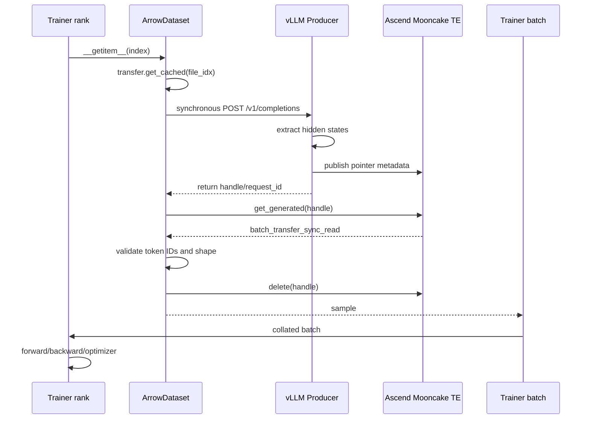
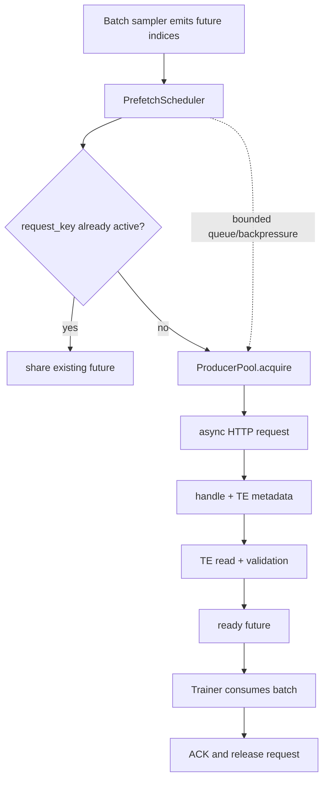
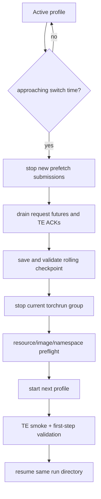

# DFlash2 Scaling Design

This design is based on the runtime repository:

```text
/mnt/hcs/y00917737/te_dspark_submission/speculators
```

It targets the current Ascend `mooncake-te` path and keeps the existing
training semantics. The design is not a proposal to replace it with the
ordinary CPU/payload `mooncake` backend.

## Design Decision

The system should be scaled in this order:

```text
Current synchronous 1P/1T data path
        |
        v
Instrumented 1P/1T path
        |
        v
1P/1T bounded prefetch with safe TE ownership
        |
        v
1P/multi-Trainer FSDP
        |
        v
multi-Producer pool + direct TE payload transfer
        |
        v
checkpoint-boundary night/day controller
```

`P` means a vLLM hidden-state Producer replica. `T` means a Trainer process
group, not an individual process.

The first implementation must not combine all changes. Each stage needs to
answer one performance question and preserve the previous stage as a baseline.

## Community Work Mapping

### PR #811: bounded asynchronous fan-out

<https://github.com/vllm-project/speculators/pull/811>

Reuse these ideas:

- bounded lookahead;
- duplicate miss coalescing;
- independent consumer cursor;
- lease-based artifact lifetime;
- failure accounting;
- no global progress barrier between consumers.

Do not copy its POSIX artifact implementation into the Ascend TE path. Replace
the artifact lease with a TE request lease and ACK state.

### PR #605: Mooncake hidden-state transfer

<https://github.com/vllm-project/speculators/pull/605>

Reuse its request-id-keyed transfer contract. The current runtime already has
the same broad shape: HTTP returns a request handle, and the Consumer resolves
that handle through a Mooncake store.

The missing pieces left by that prototype are exactly the pieces this design
adds: Trainer-side prefetch and Producer fleet scheduling.

### PR #710: multi-node Mooncake TCP/RDMA

<https://github.com/vllm-project/speculators/pull/710>

Use as transport reference only. It is not a validated dependency for the
current branch. The current production experiment uses the local Ascend
TransferEngine implementation in `mooncake_te_*`.

### PR #967: checksummed manifest and recovery

<https://github.com/vllm-project/speculators/pull/967>

Reuse its correctness requirements:

- complete publication marker;
- finite-value validation;
- shape/token validation;
- checksum or equivalent identity validation;
- explicit failure manifest and retry accounting.

For `mooncake-te`, checksum validation must not become an extra full-size copy
on the critical path unless enabled for validation mode. Shape, token count,
Producer identity, and ACK ownership are mandatory in production; checksum can
be sampled or required in correctness tests.

### PR #972: multi-node Trainer example

<https://github.com/vllm-project/speculators/pull/972>

Reuse its explicit multi-node launch model and Slurm wiring. It demonstrates
multi-node extraction plus a Trainer group, but does not provide elastic FSDP
world-size changes or multi-Producer routing.

### PR #1013: scale-out render front end

<https://github.com/vllm-project/speculators/pull/1013>

Reuse its measured bounded-concurrency approach. Its `api-server-count` and
`renderer-num-workers` scale the render/tokenization front end; they do not
scale the hidden-state TE Producer. The distinction must remain explicit in
the launcher and metrics.

## Current Runtime Path

The actual training path is synchronous in `src/speculators/train/data.py`:



The current formal launcher uses `num_workers=0`, `--nnodes=1`, and one
Producer IP/endpoint. DataLoader's existing `prefetch_factor` is not training
request prefetch: it only controls batches already produced by DataLoader
workers, and using NPU TE operations from forked/spawned workers is not a safe
substitute for a Trainer-owned TE scheduler.

## Target Interfaces

The interfaces below are contracts. Names can be adjusted during coding, but
the ownership and state transitions should not be weakened.

### Producer endpoint

```python
@dataclass(frozen=True)
class ProducerEndpoint:
    producer_id: str
    base_url: str                 # HTTP /v1 endpoint
    te_hostname: str              # advertised TE source hostname
    te_rpc_port: int | None       # discovered from metadata if None
    metadata_namespace: str
    max_in_flight: int = 1
```

The endpoint is configuration and identity, not just a URL. All replicas in a
pool must pass the same model, layer IDs, context length, image ID, connector
revision, and TE protocol preflight.

### Producer pool

```python
class ProducerPool(Protocol):
    async def start(self) -> None: ...
    async def close(self, *, drain: bool = True) -> None: ...
    async def health(self) -> list[ProducerHealth]: ...

    async def acquire(self, request_key: str) -> ProducerLease: ...
    async def release(self, lease: ProducerLease) -> None: ...
```

```python
@dataclass(frozen=True)
class ProducerLease:
    request_key: str
    producer: ProducerEndpoint
    lease_id: str

@dataclass(frozen=True)
class ProducerHealth:
    producer_id: str
    healthy: bool
    in_flight: int
    max_in_flight: int
    last_error: str | None
```

`acquire()` must use least-in-flight with a deterministic tie-breaker, not
blind round-robin. It must refuse a draining or unhealthy Producer. The pool
does not proxy hidden-state payloads.

### Request state

```python
class RequestState(str, Enum):
    QUEUED = "queued"
    ASSIGNED = "assigned"
    HTTP_DONE = "http_done"
    PUBLISHED = "published"
    TE_READING = "te_reading"
    READY = "ready"
    CONSUMED = "consumed"
    RELEASED = "released"
    FAILED = "failed"
```

```python
@dataclass
class HiddenStateRequest:
    request_key: str       # logical sample identity
    dataset_index: int
    producer_lease: ProducerLease | None
    handle: str | None
    state: RequestState
    future: asyncio.Future[dict[str, torch.Tensor]] | None
    timings: dict[str, float]
    attempts: int = 0
    error: str | None = None
```

The same logical sample must not be concurrently assigned to two Producers.
Duplicate requests are coalesced by `request_key`; this is the direct
application of PR #811's duplicate-miss rule.

### TE metadata contract

The current metadata should be extended from an unqualified Producer address
to an ownership-bearing manifest:

```json
{
  "version": 2,
  "request_key": "sample-123",
  "producer_id": "producer-b",
  "producer_ip": "71.10.29.130",
  "rpc_port": 20454,
  "metadata_namespace": "producer-b",
  "state": "published",
  "tensors": {
    "hidden_states": {
      "ptr": 123,
      "size": 503255040,
      "shape": [8191, 6, 5120],
      "dtype": "torch.bfloat16"
    }
  }
}
```

Publication remains atomic: write a temporary manifest, fsync if required by
the selected metadata filesystem, then rename to the final marker. The
Consumer must reject a mismatched `request_key`, `producer_id`, shape, or token
count.

### TE store ownership API

```python
class HiddenStateLease(Protocol):
    request_key: str
    producer_id: str

class MooncakeTEStore(Protocol):
    def publish(self, request: HiddenStateRequest, payload: TensorSpec) -> None: ...
    def read(self, lease: HiddenStateLease, *, timeout: float) -> TensorDict: ...
    def acknowledge(self, lease: HiddenStateLease) -> None: ...
    def release(self, lease: HiddenStateLease) -> None: ...
```

The implementation may continue to use the current `.json` and `.ack` files,
but their names must be namespace-qualified when multiple Producers share a
metadata root:

```text
<TE_META_ROOT>/<producer_id>/<request_key>.json
<TE_META_ROOT>/<producer_id>/<request_key>.ack
```

The current `_prev_te_key` single-request ACK guard cannot be removed until a
per-request buffer/ring ownership scheme is proven. A safe first multi-request
implementation may keep one in-flight request per Producer while allowing
different Producers to work concurrently.

## Prefetch Scheduler

The scheduler is the first new training-side component. It should sit above the
current sample generation and below the Trainer's batch iterator.



Initial policy:

```text
max_in_flight per Trainer rank: 1
lookahead batches:              1
Producer replicas:              1
```

Only after correctness passes should the experiment set `max_in_flight=2`.
If the current Producer's single send buffer and ACK guard cannot support that,
the scheduler must remain at one request per Producer and only overlap safe
CPU/request preparation with Trainer compute.

The scheduler must expose:

```python
class PrefetchScheduler(Protocol):
    def submit(self, sample: SampleRef) -> RequestFuture: ...
    def get(self, sample: SampleRef) -> TensorSample: ...
    def cancel(self, request_key: str) -> None: ...
    async def drain(self, *, timeout: float) -> None: ...
```

`get()` may block for the requested sample, but it should not submit the
request synchronously if the request was already placed in the lookahead queue.

## Metrics Contract

Every request and every training step should report the following where
available:

```text
queue_wait_ms
http_submit_ms
http_response_ms
producer_publish_ms
ack_wait_ms
metadata_wait_ms
te_read_ms
validation_ms
fetch_ms
fwd_ms
bwd_ms
opt_ms
```

The old `fetch_ms` remains for compatibility, but the new fields determine the
bottleneck. Producer metrics should additionally report:

```text
in_flight
queue_depth
copy_to_send_buffer_ms
send_buffer_bytes
ack_timeout_total
te_publish_errors
```

## Multi-Trainer Launcher Interface

The current `start_train_te_dflash2.sh` hard-codes `--nnodes=1`. Replace that
with a profile-driven launcher:

```text
NNODES=2
NODE_RANK=0|1
MASTER_ADDR=<rendezvous host>
MASTER_PORT=<rendezvous port>
NPROC_PER_NODE=2
```

The launcher should validate:

- all nodes use the same code revision and immutable image ID;
- all nodes see the same dataset and checkpoint path;
- `world_size = NNODES * NPROC_PER_NODE` is compatible with the selected
  `sp_size`;
- the TE initialization happens before HCCL on each rank as required by the
  current Ascend path;
- Producer endpoint and TE metadata namespace are available from every node.

Start with one Producer and one multi-node Trainer group. This isolates FSDP
scaling from Producer-pool scaling.

## Night/Day Profiles

```yaml
profiles:
  day:
    trainer_nodes: 1
    nproc_per_node: 2
    producer_replicas: 1
    producer_max_in_flight: 1
  night:
    trainer_nodes: 2
    nproc_per_node: 2
    producer_replicas: 2
    producer_max_in_flight: 1
```

The first night profile should actually use `producer_replicas: 1` until the
multi-Trainer experiment shows that the single Producer is saturated. The
configuration above describes the eventual shape, not an immediate launch
recommendation.



The handoff is always a restart at a checkpoint boundary. No live mutation of
the distributed process group is required.

## Implementation Tasks

### T0: instrumentation only

Files:

- `src/speculators/train/data.py`
- `hs_connectors/src/hs_connectors/mooncake_te_connector.py`
- `hs_connectors/src/hs_connectors/mooncake_te_store.py`
- `src/speculators/train/trainer.py`

Add timings and request identity logging without changing scheduling.

Acceptance: current training produces stage timings and remains numerically
equivalent.

### T1: single-Producer scheduler

Files:

- new `src/speculators/train/prefetch.py`
- `src/speculators/train/data.py`
- `src/speculators/data_generation/vllm_client.py`
- training config schema/CLI

Add async HTTP submission, one-request lookahead, duplicate coalescing, and
drain. Keep the default disabled.

Acceptance: 50-200 step smoke and several-hundred-step A/B show lower fetch
wait without OOM, ACK timeout growth, stale metadata, or metric drift.

### T2: safe TE request ownership

Files:

- `hs_connectors/src/hs_connectors/mooncake_te_store.py`
- `hs_connectors/src/hs_connectors/mooncake_te_connector.py`
- unit/integration TE contract tests

Add versioned metadata, Producer identity, namespace, lease state, and explicit
ACK/release tests. Preserve the current ACK barrier until a ring-buffer design
is validated.

### T3: multi-node Trainer

Files:

- `deploy/start_train_te_dflash2.sh`
- `deploy/start_cross_node_roce_smoke.sh`
- a new profile/topology launcher, or the existing Kimi-K3 launcher adapted for
  Ascend TE

Add `NNODES`, `NODE_RANK`, `MASTER_ADDR`, and `MASTER_PORT`. Validate FSDP
checkpoint resume at the intended world sizes.

### T4: ProducerPool

Files:

- new `src/speculators/train/producer_pool.py`
- `src/speculators/train/prefetch.py`
- `hs_connectors` metadata/TE ownership implementation
- deployment profile and health checks

Start with one request per Producer. Scale across Producers before increasing
per-Producer concurrency. This avoids repeating the historical single-Producer
8K `MAX_NUM_SEQS=2` OOM failure.

## Acceptance Matrix

| Stage | Producer | Trainer | Main question | Required result |
| --- | --- | --- | --- | --- |
| T0 | 1 | current 2 ranks | Where is fetch time? | stage metrics, no regression |
| T1 | 1 | current 2 ranks | Does lookahead hide wait? | lower fetch/step time, safe ACK |
| T2 | 1 | current 2 ranks | Is TE ownership safe? | no stale/overwritten payload |
| T3 | 1 | multi-node FSDP | Does compute scale? | lower compute time without fetch collapse |
| T4 | 2+ | multi-node FSDP | Does fleet scale? | throughput improves with bounded errors |
| T5 | profile-based | profile-based | Can night/day switch? | checkpoint-boundary resume |

## Non-Goals

- Do not use ordinary `mooncake` async writer settings as proof that
  `mooncake-te` is asynchronously safe.
- Do not route hidden-state payloads through an HTTP proxy.
- Do not remove ACK synchronization based only on performance measurements;
  it protects against KV cache block reuse races.
- Do not assume an FSDP checkpoint can change world size until the actual
  Ascend path has passed a resume test.
- Do not modify the active formal run to test T1-T5.
